## 海湉师兄毕设展示Web应用搭建过程文档

### 需求沟通

- 页面设置
  - 注册登录
  - 静态页面
  - 建筑页面
  - 结果页（提供下载，格式为pdf或者jpg等图片格式）
- 数据关系
  - 人和建筑：一对多
  - 建筑和数据case：一对多
- 数据相关
  - 数据类型
    - 短期数据（暂定数据量小于60就认为是短期数据）
      - 分析时有一个既定的标准
      - 最后画成散点图
    - 长期数据
    - 格式为(温度,空调能耗,总能耗)
    - 期望产出：两张图+两组参数(E0+E1,E_t(30)) + 一个函数
    - 拟合曲线的图
    - 能耗的ABCDE评价图，是根据参数组(E0+E1, E(30))画出的，需要注意有几个区域是固定的，其他区域是可以无限延伸的
- 目前已有的资料
  - 数据模板done
  - 结果模板(直接将产出的图做成pdf了)
  - 静态页面内容done
- 其他类似网站效果
  - 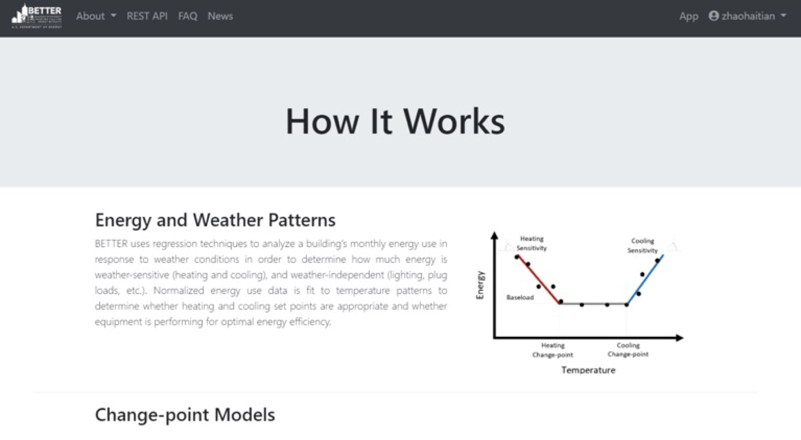
  - 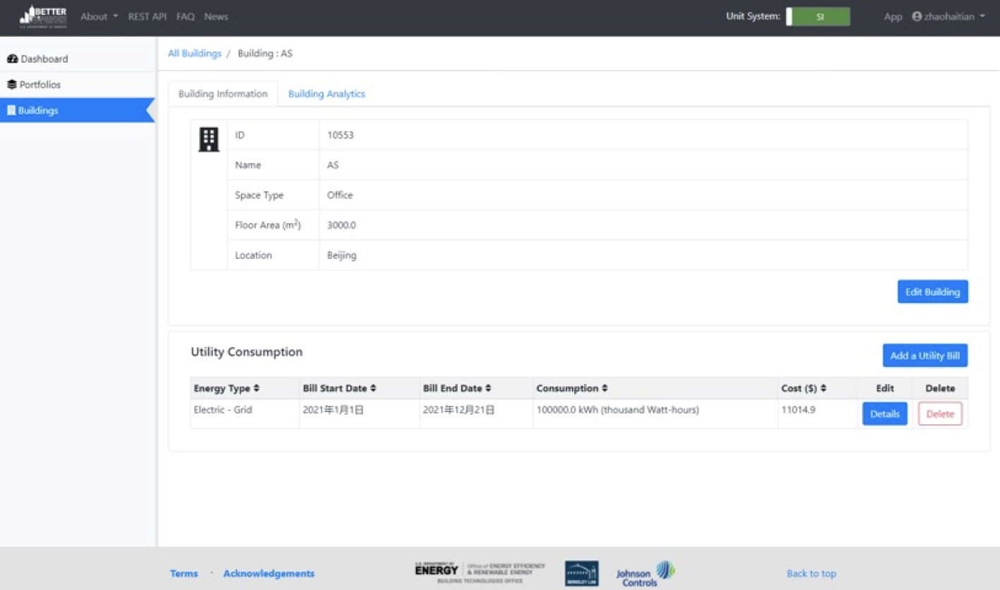

### 技术栈选择

- 前端框架/模板：```BootStrap 4```+[SB Admin 2](https://startbootstrap.com/)

- 后端框架：```Flask```

- 数据库：```MySQL 8.0.27(本地)/MariaDB(网站部署服务器)```

- 使用到的可能需安装的其他第三方库：

  - ``` python
    # 0.整体环境
    # Python 3.8
    # Anaconda
    # 1.数据库连接
    # pymysql
    # 2.科学计算
    # pandas, numpy, scipy
    # 3.画图
    # matplotlib, seaborn
    # 4.生成pdf
    # fpdf, PIL
    # 5.flask插件
    # flask_login, flask_wtf
    ```


### 数据表结构

- 登录相关表

  - 用户信息表：```(<u>userid</u>, username, password(加密字符串))```

  - ```sql 
    create table if not exists `user_info`(
      `user_id` CHAR(8) NOT NULL,
      `user_name` VARCHAR(50) NOT NULL,
      `password` VARCHAR(200) NOT NULL,
      PRIMARY KEY(`user_id`)
    )ENGINE=InnoDB DEFAULT CHARSET=utf8;
    ```

  - 用户验证码表：```(<u>username</u>, code)```

  - ``` sql
    create table if not exists `user_valid_code`(
      `seq` INT UNSIGNED AUTO_INCREMENT,
      `user_id` CHAR(8) NOT NULL,
      `code` VARCHAR(10) NOT NULL,
      `sendTime` datetime NOT NULL,
      PRIMARY KEY(`seq`),
      FOREIGN KEY(`user_id`) REFERENCES `user_info` (`user_id`)
    )ENGINE=InnoDB DEFAULT CHARSET=utf8;
    ```
    
  - 用户资料表：```(<u>userid</u>, gender, profession, belong, register_time)```
  
  - ``` sql
    create table if not exists `user_profile`(
      `record_id` INT UNSIGNED AUTO_INCREMENT,
      `user_id` CHAR(8) NOT NULL,
      `user_name` VARCHAR(50) NOT NULL,
      `avatar` VARCHAR(255) DEFAULT 'unknown_1.svg',
      `gender` CHAR(1) DEFAULT 'U',
      `profession` VARCHAR(30) DEFAULT 'UNKNOWN',
      `belong` VARCHAR(50) DEFAULT 'UNKNOWN',
      `register_time` datetime NOT NULL,
      PRIMARY KEY(`record_id`),
      FOREIGN KEY(`user_id`) REFERENCES `user_info` (`user_id`)
    )ENGINE=InnoDB DEFAULT CHARSET=utf8;
    ```
  
- 建筑信息相关表

  - 用户名下建筑表：```(<u>buildingid</u>, *userid*, building_name, address, building_type, area, cold_source, terminal_equipment)```

  - ```sql
    create table if not exists `building_info`(
      `building_id` CHAR(8) NOT NULL,
      `user_id` CHAR(8) NOT NULL,
      `building_name` VARCHAR(100) NOT NULL,
      `building_img` VARCHAR(255) DEFAULT '/img/bg_arch.jpeg',
      `address` VARCHAR(100),
      `building_type` VARCHAR(20),
      `area` DOUBLE,
      `cold_source` VARCHAR(30),
      `terminal_equipment` VARCHAR(30),
      `create_time` datetime NOT NULL,
      PRIMARY KEY(`building_id`),
      FOREIGN KEY(`user_id`) REFERENCES `user_info`(`user_id`)
    )ENGINE=InnoDB DEFAULT CHARSET=utf8;
    ```

- 建筑对应数据表

  - 建筑对应观测数据表：```(<u>caseid, buildingid</u>, data)```

  - ```sql
    create table if not exists `building_data`(
      `case_id` CHAR(8) NOT NULL,
      `building_id` CHAR(8) NOT NULL,
      `data_type` INT NOT NULL,
      `has_fix` BOOLEAN NOT NULL,
      `data` JSON NOT NULL,
      `upload_time` DATETIME NOT NULL,
      `generate_report` BOOLEAN DEFAULT FALSE NOT NULL,
      `report_addr` VARCHAR(255),
      PRIMARY KEY(`case_id`),
      FOREIGN KEY(`building_id`) REFERENCES `building_info`(`building_id`)
    )ENGINE=InnoDB DEFAULT CHARSET=utf8;
    ```

### 已完成部分

1. 静态页面展示

   1. 未登录时

      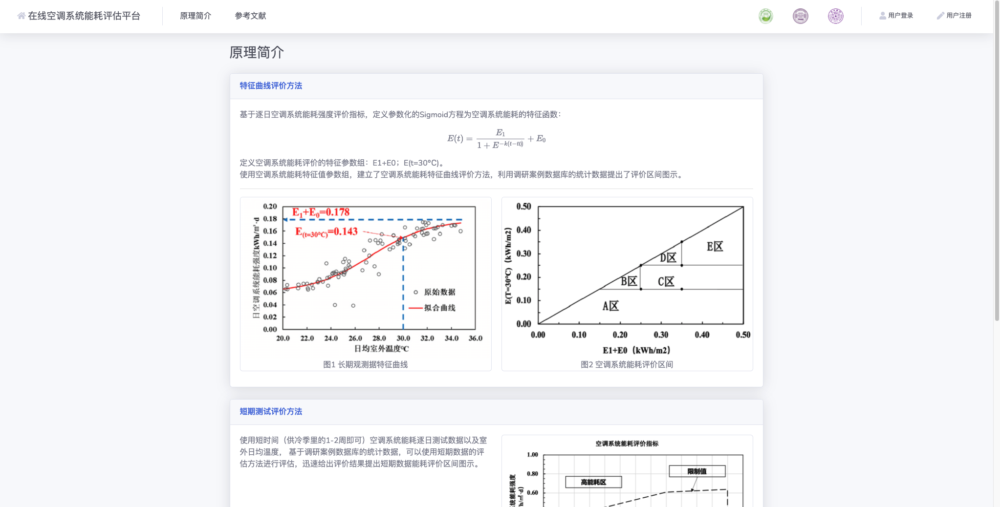

      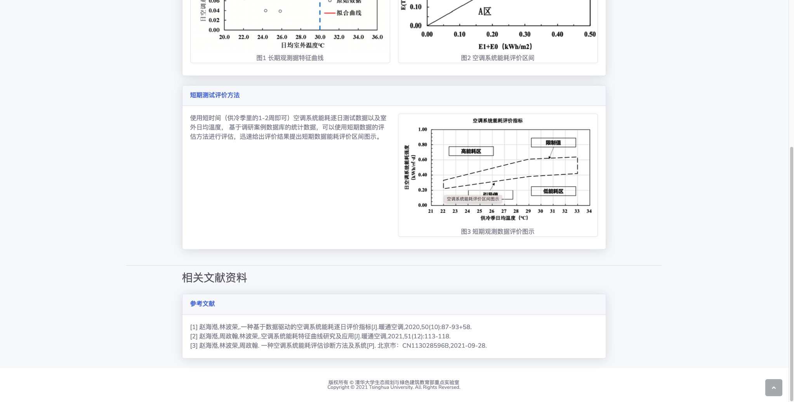

   2. 登录后

      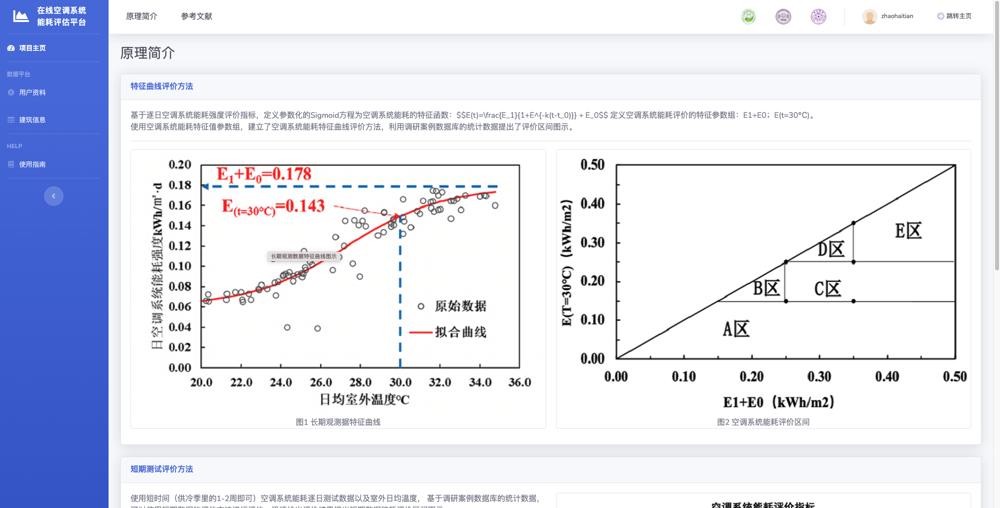

2. 登录/注册

   1. 登录

      

   2. 注册

      

3. 个人信息页面

   1. 总体

      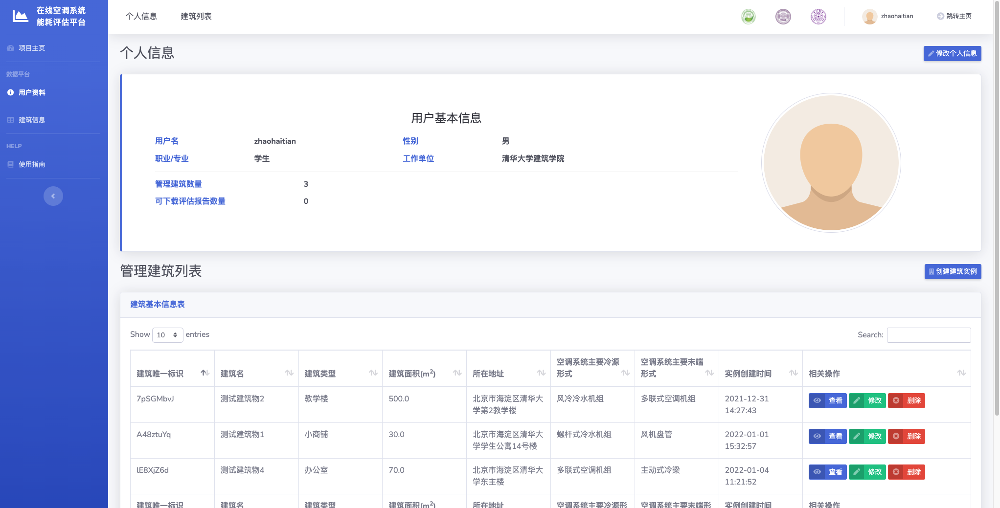

   2. 修改个人信息

      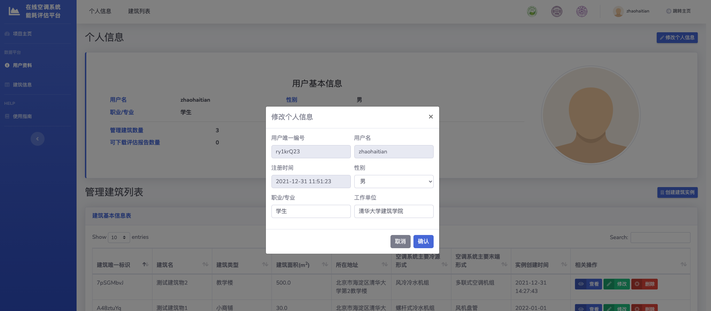

   3. 创建建筑实例

      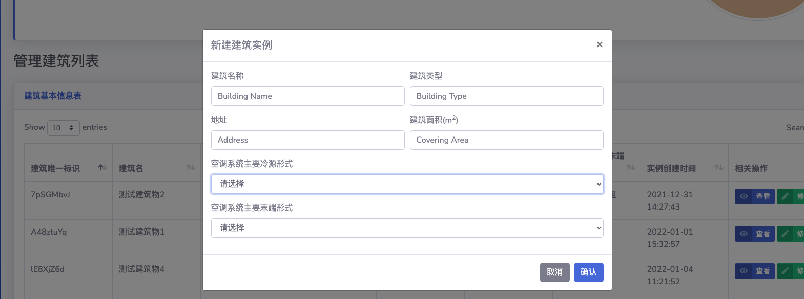

4. 建筑信息页面

   1. 总体

      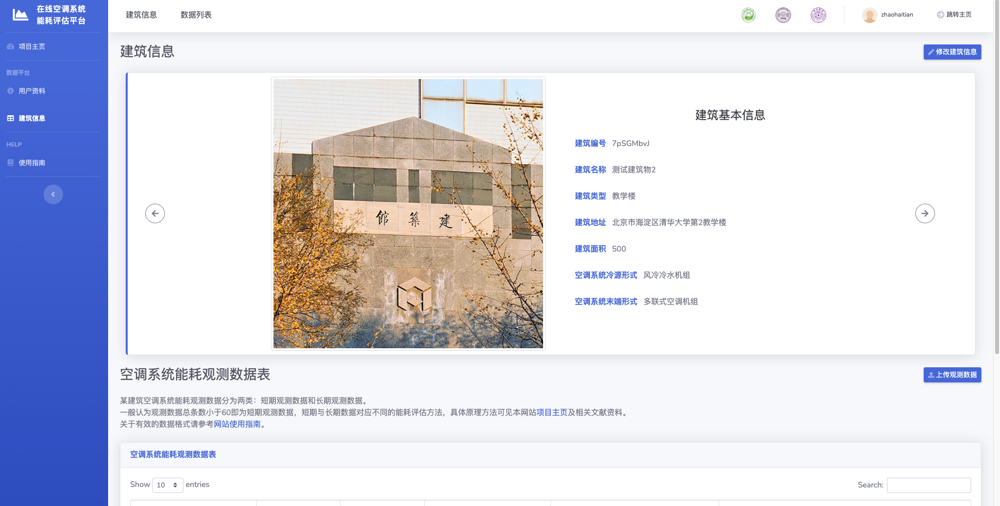

      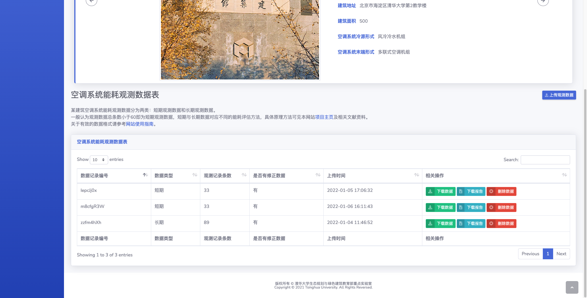

   2. 修改建筑信息

      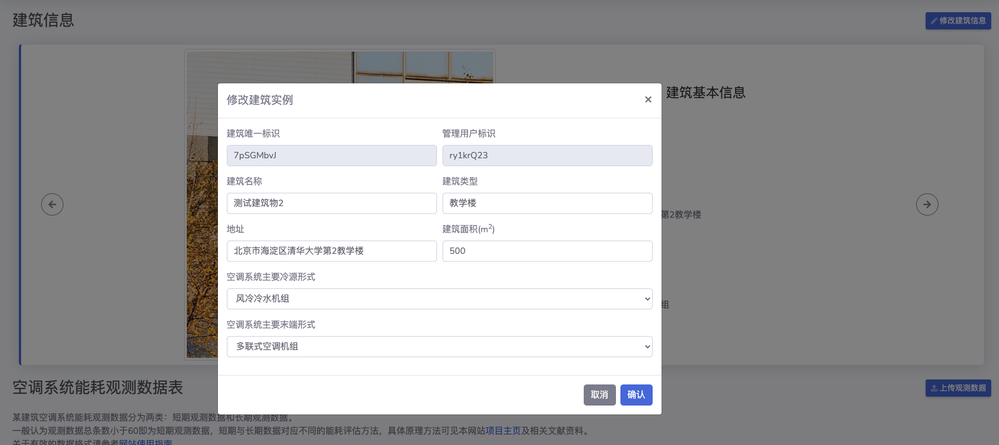

   3. 上传观测数据

      

5. 产出报告示例

   | 长期数据Sigmoid拟合曲线            | 长期数据特征评价区间            | 短期数据散点图                |
   | ---------------------------------- | ------------------------------- | ----------------------------- |
   | 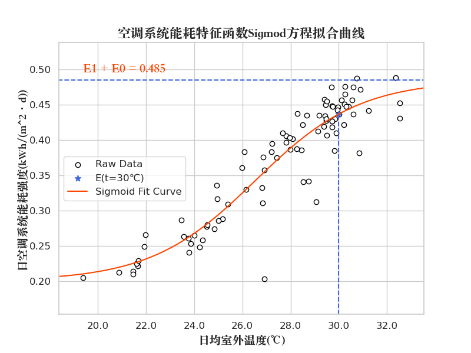 | 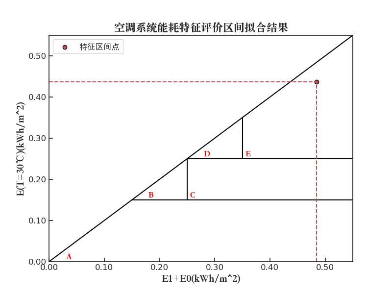 | 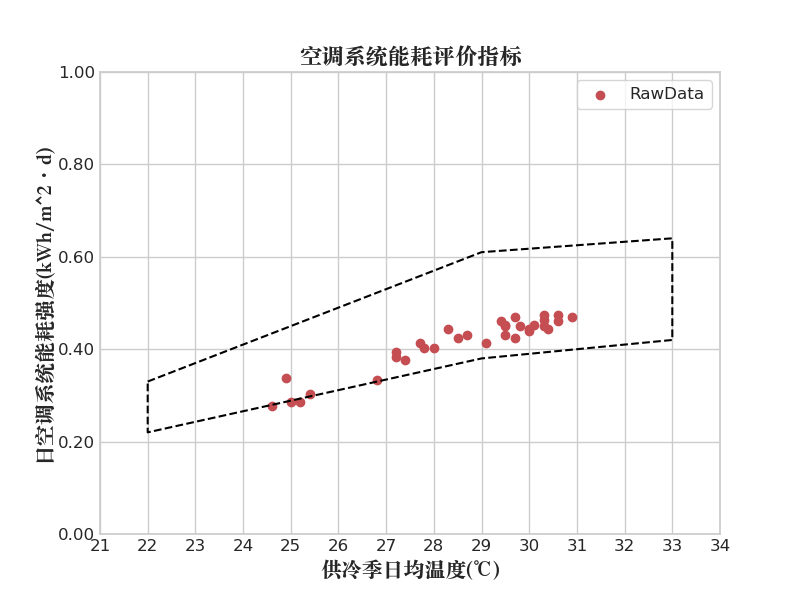 |

### 整体功能说明

- 可登录/注册/登出（不可修改密码，暂未实现）
  - 目前可用的账号：```username='zhaohaitian', password='123456'```
- 可修改个人信息（头像不可修改）
- 可创建/修改/删除建筑实例
- 可上传/下载观测数据文件，下载评估报告（图片转成了pdf格式，长期对应两张图，短期对应一张散点图）

### 优先级较低的TODO项

- 增加忘记/修改密码页面
- 实现修改个人头像和建筑图片的接口
- 增加使用指南页面（具体告知数据单位和处理格式）
- jinja2模板渲染的部分变量用在了页面的js代码中，导致页面写js写的特别长，这部分还需要优化，把js单独移到文件中，但是这样js中就不可以使用jinja2渲染的变量，否则会出错
- 性能问题没有考虑

### 服务器部署
- 工具：Nginx+uWSGI
- 地址：http://45.76.157.203/
- 域名：hvac-sig.org, www.hvac-sig.org